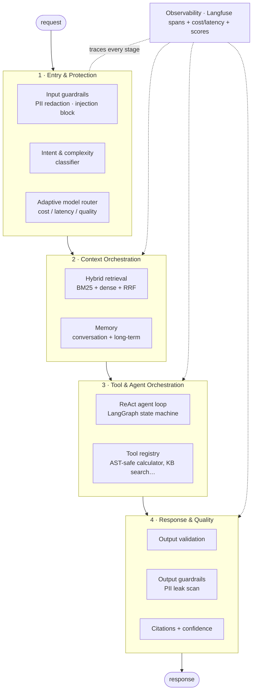
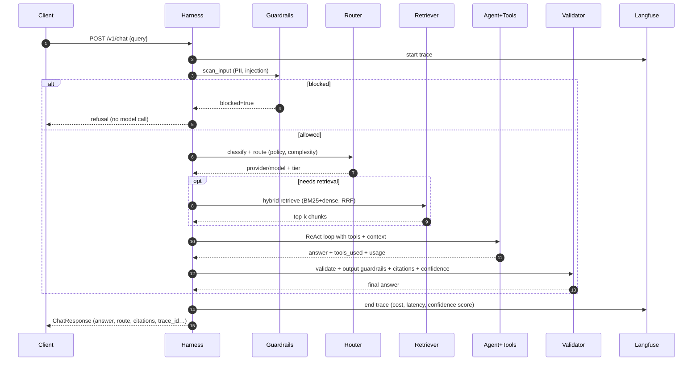

# Architecture

`ai-harness` is the **decision layer** that wraps a raw LLM and turns it into a
reliable, observable agent. A model alone is a token predictor; the harness is
everything around it that makes it safe, grounded, cheap, and debuggable.

> An agent = a model + a harness. This repo is the harness.

## Layered view

## Request lifecycle

## Stage → code map

| Layer | Stage | Module |
| --- | --- | --- |
| Entry & Protection | Input/output guardrails | [src/ai_harness/stages/guardrails.py](../src/ai_harness/stages/guardrails.py) |
| Entry & Protection | Intent & complexity | [src/ai_harness/stages/intent.py](../src/ai_harness/stages/intent.py) |
| Entry & Protection | Adaptive routing | [src/ai_harness/stages/router.py](../src/ai_harness/stages/router.py) |
| Context Orchestration | Hybrid retrieval | [src/ai_harness/stages/retrieval.py](../src/ai_harness/stages/retrieval.py) |
| Context Orchestration | Memory | [src/ai_harness/stages/memory.py](../src/ai_harness/stages/memory.py) |
| Tool & Agent Orchestration | ReAct loop | [src/ai_harness/stages/agent.py](../src/ai_harness/stages/agent.py) |
| Tool & Agent Orchestration | Tools | [src/ai_harness/tools/](../src/ai_harness/tools/) |
| Response & Quality | Validation, citations, confidence | [src/ai_harness/stages/validation.py](../src/ai_harness/stages/validation.py) |
| Cross-cutting | Tracing + cost/latency + scores | [src/ai_harness/observability.py](../src/ai_harness/observability.py) |
| Orchestrator | The pipeline itself | [src/ai_harness/pipeline.py](../src/ai_harness/pipeline.py) |

## Design decisions

- **Provider abstraction with a deterministic mock.** Every provider implements one
  `complete()` method. The `mock` provider honours the same prompt protocols as a
  real model, so the entire system runs — and is *tested and evaluated* — with zero
  API keys and zero network. Switching to OpenAI/Anthropic changes one env var.
- **Typed state object.** `HarnessContext` flows through every stage; each stage
  reads and writes it. State is explicit, not hidden in closures.
- **Routing is the highest-ROI knob.** Most requests are simple and go to a cheap,
  fast model; only genuinely complex requests earn the expensive tier. Policy
  (`cost` / `balanced` / `quality` / `latency`) is per-request overridable.
- **Hybrid retrieval over single-method.** Sparse BM25 catches exact terms, dense
  vectors catch paraphrase; Reciprocal Rank Fusion merges them without tuning weights.
- **Guardrails fail closed.** Injection over threshold refuses *before* any model
  call (cheapest, safest place). Output is re-scanned for PII leaks.
- **Tools can't execute code.** The calculator evaluates an AST allow-list, never
  `eval`. A tricked model still can't run arbitrary code (OWASP A03).
- **Observability is wired in, not bolted on.** Each stage is a span with cost and
  latency; user feedback attaches as a Langfuse score on the trace.

## Extending it

Add a stage by writing a function in `stages/`, calling it inside
`Harness.run` wrapped in a `trace.span(...)`, and adding a unit test plus an
`evals/dataset.jsonl` example. See [AGENTS.md](../AGENTS.md) for the contribution bar.
